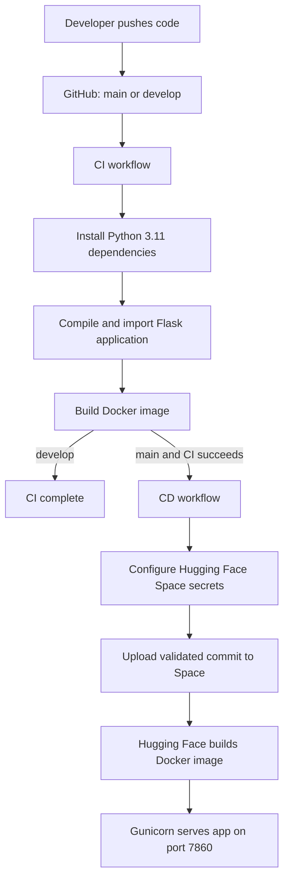

# Eco Opti Agent

Eco Opti Agent is a Flask, LangChain, and LangGraph application that serves a
static HTML/CSS/JavaScript frontend and uses the Hugging Face Inference API for
AI recommendations.

## Deployment Architecture



## CI/CD Behavior

| Git event | CI | Docker validation | Hugging Face deployment |
|---|---:|---:|---:|
| Push to `develop` | Yes | Yes | No |
| Push to `main` | Yes | Yes | Yes, after CI succeeds |
| Push to another branch | No | No | No |

The deployment target is
[`tanzz07/Eco-0pti_AGent`](https://huggingface.co/spaces/tanzz07/Eco-0pti_AGent).
The Space identifier contains a zero in `0pti`; keep the spelling and casing
unchanged.

## Required GitHub Secrets

Open the GitHub repository, then go to **Settings > Secrets and variables >
Actions > New repository secret** and create:

| Secret | Purpose |
|---|---|
| `HF_TOKEN` | Hugging Face write token used only by CD to update the Space |
| `JWT_SECRET_KEY` | Strong random key used by Flask-JWT-Extended |
| `HUGGINGFACEHUB_API_TOKEN` | Hugging Face inference token used by the AI agents |

Create `HF_TOKEN` at
[`huggingface.co/settings/tokens`](https://huggingface.co/settings/tokens) with
write access to the target Space. Never commit any token or `.env` file.

The CD workflow copies `JWT_SECRET_KEY` and `HUGGINGFACEHUB_API_TOKEN` into the
Space's encrypted secrets before uploading the application. `HF_TOKEN` remains
in GitHub Actions and is not added to the application container.

## Initial Setup

1. Confirm that the Hugging Face Space `tanzz07/Eco-0pti_AGent` exists and uses
   the Docker SDK.
2. Add all three GitHub repository secrets listed above.
3. In GitHub, optionally create an environment named `production`. Do not add
   required reviewers if deployment must remain fully automatic.
4. Push the files to `develop` to validate CI.
5. Merge or push the validated commit to `main`.
6. Open the GitHub **Actions** tab and verify that `CI` succeeds, followed by
   `CD`.
7. Open the Space and inspect its build logs if the Hugging Face Docker build
   is still in progress.

Generate a suitable JWT key locally with:

```bash
python -c "import secrets; print(secrets.token_urlsafe(64))"
```

## Local Development

```bash
python -m venv .venv
```

On Windows PowerShell:

```powershell
.\.venv\Scripts\Activate.ps1
python -m pip install -r requirements.txt
$env:JWT_SECRET_KEY = "replace-with-a-local-secret"
$env:HUGGINGFACEHUB_API_TOKEN = "replace-with-an-inference-token"
python backend/main.py
```

The application is available at `http://localhost:7860`.

Production-style local execution:

```bash
gunicorn --chdir backend --workers 1 --threads 4 --timeout 120 --bind 0.0.0.0:7860 main:app
```

## Generated and Updated Files

| File | Responsibility |
|---|---|
| `.github/workflows/ci.yml` | Runs dependency installation, syntax checks, application import validation, and `docker build` on `main` and `develop` |
| `.github/workflows/cd.yml` | Runs only after successful `main` CI, configures Space secrets, and atomically uploads the validated commit with the official `huggingface_hub` client |
| `Dockerfile` | Builds the Python 3.11 image, runs as a non-root user, exposes port 7860, adds a health check, and starts Gunicorn |
| `.dockerignore` | Excludes local environments, secrets, caches, generated reports, Git metadata, and CI-only files from the image |
| `requirements.txt` | Pins runtime dependencies for reproducible CI and Space builds |
| `backend/main.py` | Reads JWT and database configuration from environment variables and supports the platform `PORT` value |
| `README.md` | Defines Docker Space metadata and documents CI/CD setup and operations |

## Runtime Notes

- The default database remains SQLite at `backend/instance/ecoopti.db`.
- Set `DATABASE_URL` to override the database connection string.
- A basic Hugging Face Space filesystem is ephemeral. For durable production
  history, attach persistent storage or migrate to a managed PostgreSQL
  database.
- Generated PDF reports are runtime data and are excluded from Git and Docker
  build context.
- Gunicorn uses one worker with four threads because SQLite initialization and
  writes are not safe across multiple worker processes. Increase the process
  count only after migrating to a server database such as PostgreSQL.

## Pipeline Result

```text
Git push
  -> GitHub Actions CI
  -> Python and project validation
  -> Docker build validation
  -> GitHub Actions CD on main
  -> Hugging Face Space upload
  -> Hugging Face Docker rebuild
  -> Updated production application
```
