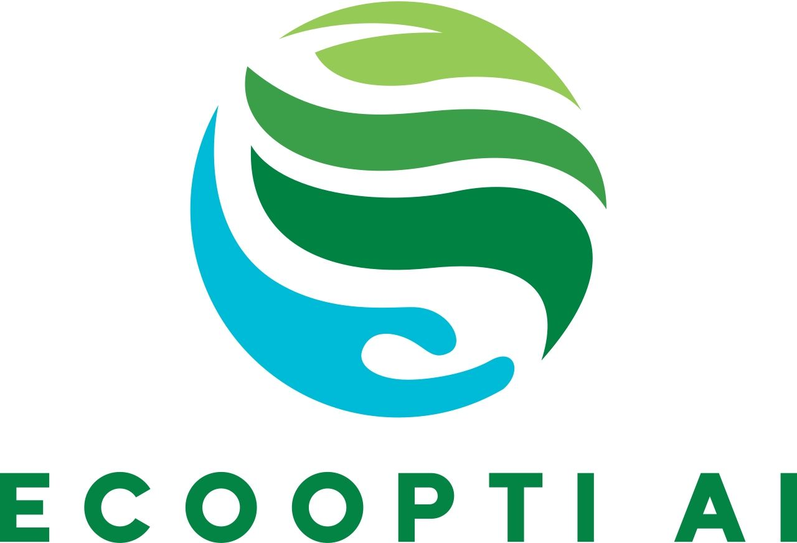

<div align="center">
  
  <h1>🌱 Eco-Opti-Agent</h1>
  <p><strong>AI-Driven Carbon Optimization for Businesses</strong></p>
  
  [](https://eco-opti-agent-g241.onrender.com)
  [](https://opensource.org/licenses/MIT)
</div>

<br />

Eco-Opti-Agent is a full-stack, multi-agent AI system designed to intelligently analyze and optimize carbon emissions for businesses. By leveraging a team of specialized AI agents, it breaks down complex emission patterns and delivers actionable, prioritized recommendations to drive real-world sustainability.

## ✨ Key Features

- **🤖 Multi-Agent Architecture**: Specialized agents for Electricity, Transport, Fuel, and Green Infrastructure.
- **📊 Smart Emission Predictor**: Calculates footprints based on real-world consumption patterns.
- **⚡ Optimizer & Decision Agents**: Synthesizes raw data into the top 3 highest-impact sustainability actions.
- **🎨 Interactive Dashboard**: Clean, responsive, and animated UI built with modern HTML/JS/CSS.
- **🚀 Unified Flask Backend**: Serves both the REST API and the frontend client seamlessly.

## 🧰 Tech Stack

| Category         | Technologies                     |
|------------------|----------------------------------|
| **Frontend**     | HTML5, CSS3, Vanilla JavaScript  |
| **Backend**      | Python, Flask, Gunicorn          |
| **AI / Logic**   | LangChain, LangGraph, Google Gemini (1.5 Flash) |
| **Deployment**   | Render                           |

## 🚀 Live Demo

Check out the live application here: **[Eco-Opti-Agent Live](https://eco-opti-agent-g241.onrender.com)**

*(Note: The demo gracefully degrades to use mock data if an API key is not provided).*

## 🛠️ Local Installation

### Prerequisites
- Python 3.10+
- Git

### Setup Instructions

1. **Clone the repository:**
   ```bash
   git clone https://github.com/Satyaprakash7325/Eco_Opti_Agent.git
   cd Eco_Opti_Agent
   ```

2. **Install dependencies:**
   ```bash
   cd backened
   pip install -r requirement.txt
   ```

3. **Set up Environment Variables:**
   Create a `.env` file in the `backened` directory and add your Google API Key (optional for mock mode):
   ```env
   GOOGLE_API_KEY=your_gemini_api_key_here
   ```

4. **Start the server:**
   ```bash
   python main.py
   ```
   Navigate to `http://localhost:5000` in your browser.

## ☁️ Render Deployment

Deploying this app is a breeze using the included Render Blueprint:
1. Push this repository to GitHub.
2. Go to the [Render Dashboard](https://dashboard.render.com/) and create a new **Blueprint**.
3. Select this repository. Render will automatically detect `render.yaml` and deploy both the backend and frontend.
4. Add your `GOOGLE_API_KEY` as an environment variable in the Render dashboard.

## 📂 Project Structure

```text
Eco_Opti_Agent/
├── backened/                 # Python Flask Backend
│   ├── agents/               # LangChain AI Agents
│   │   ├── decision_agent.py
│   │   ├── electricity_agent.py
│   │   ├── fuel_agent.py
│   │   ├── greeninfra_agent.py
│   │   ├── optimizer_agent.py
│   │   └── transport_agent.py
│   ├── main.py               # Flask App Entry Point
│   ├── utils.py              # Helper Functions
│   └── requirement.txt       # Python Dependencies
├── frontend/                 # Static Web Assets
│   ├── index.html            # Main UI
│   ├── script.js             # API Integration & Logic
│   ├── style.css             # Animations & Styling
│   └── FullLogo_NoBuffer.jpg # Brand Logo
├── render.yaml               # Render Deployment Blueprint
└── README.md                 # Project Documentation
```

## 🤝 Contributing

Contributions, issues, and feature requests are welcome!
1. Fork the project.
2. Create your feature branch (`git checkout -b feature/AmazingFeature`).
3. Commit your changes (`git commit -m 'Add some AmazingFeature'`).
4. Push to the branch (`git push origin feature/AmazingFeature`).
5. Open a Pull Request.

## 📝 License

Distributed under the MIT License. See `LICENSE` for more information.

## 📞 Support

For any questions, support, or collaboration, please contact:
📧 **patrasatyaprakash73@gmail.com**

---
<div align="center">
  <i>Built to make the world a greener place.</i>
</div>
