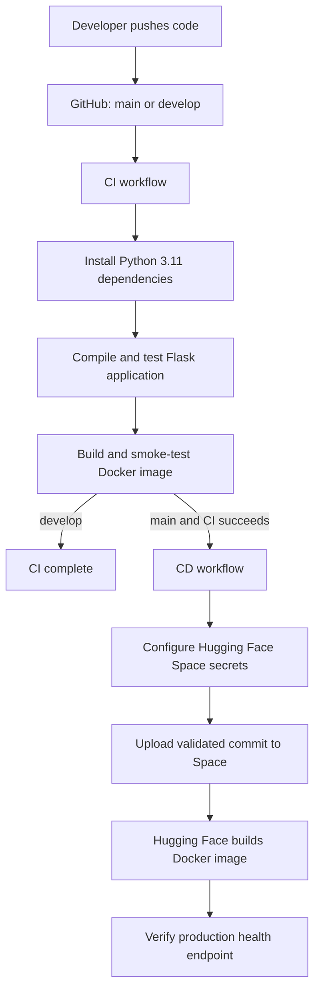

<div align="center">
  
  <h1>Eco Opti Agent</h1>
  <p><strong>AI-driven carbon optimization for businesses</strong></p>

  [](https://huggingface.co/spaces/tanzz07/Eco-0pti_AGent)
  [](https://opensource.org/licenses/MIT)
</div>

Eco Opti Agent is a Flask, LangChain, and LangGraph application that serves a
static HTML/CSS/JavaScript frontend and uses the Hugging Face Inference API for
AI recommendations.

## Key Features

- Multi-agent analysis for electricity, transport, fuel, and green infrastructure
- Carbon-emission estimates based on business usage data
- Prioritized recommendations from optimizer and decision agents
- Responsive frontend served by the Flask application
- Authenticated analysis history and downloadable reports

## Tech Stack

| Category | Technologies |
|---|---|
| Frontend | HTML5, CSS3, Vanilla JavaScript |
| Backend | Python, Flask, Gunicorn |
| AI and logic | LangChain, LangGraph, Hugging Face Inference |
| CI/CD | GitHub Actions, Docker, Hugging Face Spaces |

## Live Demo

Open the application at
[`tanzz07/Eco-0pti_AGent`](https://huggingface.co/spaces/tanzz07/Eco-0pti_AGent).
The Space identifier contains a zero in `0pti`; keep its spelling and casing
unchanged.

## Deployment Architecture



## CI/CD Behavior

| Git event | CI | Docker validation | Hugging Face deployment |
|---|---:|---:|---:|
| Pull request to `develop` or `main` | Yes | Yes | No |
| Push to `develop` | Yes | Yes | No |
| Push to `main` | Yes | Yes | Yes, after CI succeeds |
| Manual CI run | Yes | Yes | No |
| Manual CD run | No | Previously validated commit | Yes |
| Push to another branch | No | No | No |

## Required GitHub Secrets

Open the GitHub repository, then go to **Settings > Secrets and variables >
Actions > New repository secret** and create:

| Secret | Purpose |
|---|---|
| `HF_TOKEN` | Hugging Face write token used only by CD to update the Space |
| `JWT_SECRET_KEY` | Strong random key used by Flask-JWT-Extended |
| `HUGGINGFACEHUB_API_TOKEN` | Hugging Face inference token used by the AI agents |

Create `HF_TOKEN` at
[`huggingface.co/settings/tokens`](https://huggingface.co/settings/tokens) with
write access to the target Space. Never commit any token or `.env` file.

The CD workflow copies `JWT_SECRET_KEY` and `HUGGINGFACEHUB_API_TOKEN` into the
Space's encrypted secrets before uploading the application. `HF_TOKEN` remains
in GitHub Actions and is not added to the application container.

## Initial Setup

1. Confirm that the Hugging Face Space `tanzz07/Eco-0pti_AGent` exists and uses
   the Docker SDK.
2. Add all three GitHub repository secrets listed above.
3. In GitHub, optionally create an environment named `production`. Do not add
   required reviewers if deployment must remain fully automatic.
4. Open or update a pull request to validate CI.
5. Merge the validated pull request into `main`.
6. Verify that `CI` succeeds, followed by `CD`. CD waits up to 10 minutes for
   the Space `/ping` health check.
7. Inspect the Space build logs if the health check times out.

The CD workflow can also be started manually. Supply a previously validated
commit SHA to deploy that exact revision, or leave the field empty to deploy
the current `main` revision.

Generate a suitable JWT key locally with:

```bash
python -c "import secrets; print(secrets.token_urlsafe(64))"
```

## Local Development

```bash
git clone https://github.com/tanzzz07/ECO-0pti-AGENT.git
cd ECO-0pti-AGENT
python -m venv .venv
```

On Windows PowerShell:

```powershell
.\.venv\Scripts\Activate.ps1
python -m pip install -r requirements.txt
$env:JWT_SECRET_KEY = "replace-with-a-local-secret"
$env:HUGGINGFACEHUB_API_TOKEN = "replace-with-an-inference-token"
python backend/main.py
```

The application is available at `http://localhost:7860`.

Production-style local execution:

```bash
gunicorn --chdir backend --workers 1 --threads 4 --timeout 120 --bind 0.0.0.0:7860 main:app
```

Run the smoke tests:

```bash
python -m unittest discover -s tests -v
```

## Project Structure

```text
ECO-0pti-AGENT/
|-- .github/workflows/       # GitHub Actions CI and CD
|-- backend/                 # Flask application and AI agents
|-- frontend/                # Static HTML, CSS, JavaScript, and logo
|-- tests/                   # Application smoke tests
|-- Dockerfile               # Hugging Face production image
|-- requirements.txt         # Pinned Python dependencies
`-- README.md                # Project and deployment documentation
```

## Pipeline Files

| File | Responsibility |
|---|---|
| `.github/workflows/ci.yml` | Runs syntax checks, application tests, a Docker build, and a live container health check for pull requests and pushes |
| `.github/workflows/cd.yml` | Deploys successful `main` builds, supports manual rollback/redeploy, configures Space secrets, and verifies production health |
| `tests/test_app.py` | Exercises health, frontend delivery, registration, and login without external API calls |
| `Dockerfile` | Builds the Python 3.11 image, runs as a non-root user, and starts Gunicorn |
| `.dockerignore` | Excludes local environments, secrets, caches, and generated data |
| `backend/main.py` | Reads runtime configuration from environment variables |

## Runtime Notes

- The default database remains SQLite at `backend/instance/ecoopti.db`.
- Set `DATABASE_URL` to override the database connection string.
- A basic Hugging Face Space filesystem is ephemeral. For durable production
  history, attach persistent storage or migrate to a managed PostgreSQL database.
- Gunicorn uses one worker with four threads because SQLite writes are not safe
  across multiple worker processes.

## Contributing

Contributions, issues, and feature requests are welcome:

1. Create a feature branch.
2. Commit and push the change.
3. Open a pull request against `main`.
4. Wait for CI to pass before merging.

## Support

For questions or collaboration, contact **tanmaypradhan31@gmail.com**.

## Pipeline Result

```text
Git push
  -> GitHub Actions CI
  -> Python tests and Docker health validation
  -> Merge to main
  -> GitHub Actions CD
  -> Hugging Face Space upload and rebuild
  -> Production health verification
```
